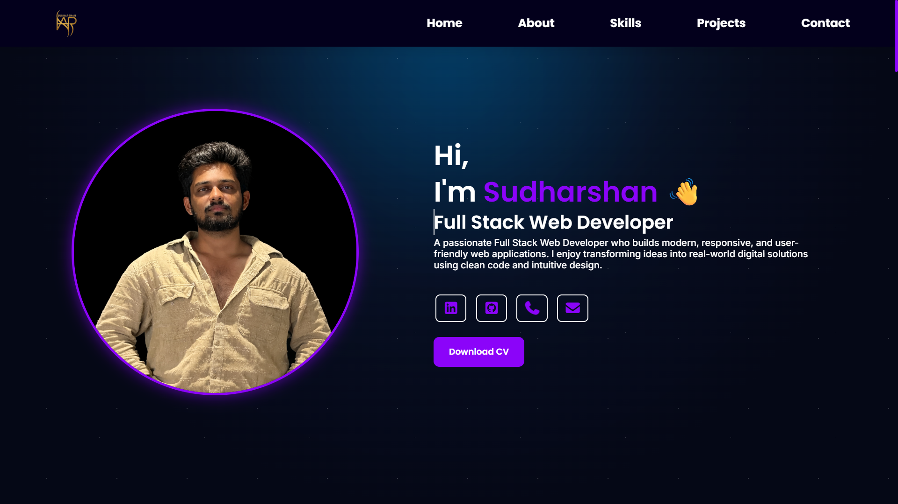
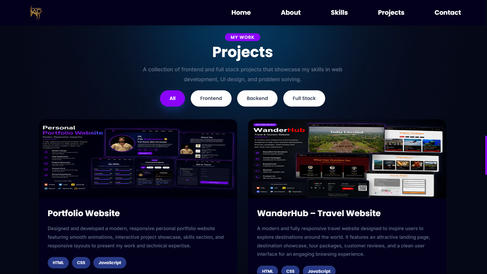

# 🌐 Personal Portfolio Website

A modern, responsive personal portfolio website showcasing my skills, projects, and experience as a Full Stack Web Developer.

## 🚀 Live Demo

🔗 https://sud-debug66.github.io/Portfolio/

---

## 📌 Features

- Responsive design for all devices
- Clean and modern UI
- Loading Animations
- About Me section
- Skills section
- Projects showcase
- Contact section
- Social media links
- Smooth scrolling
- Interactive animations

---

## 🛠️ Tech Stack

- HTML5
- CSS3
- JavaScript
- Git
- GitHub
- GitHub Pages

---

## 📂 Project Structure

```
Portfolio/
│── index.html
│── style.css
│── script.js
│── images/
│── LICENSE
└── README.md

```

---

## ⚙️ Installation

1. Clone the repository

```bash
git clone https://github.com/Sud-deBUG66/Portfolio.git
```
clear
2. Open the project folder

```bash
cd Portfolio
```

3. Open `index.html` in your browser.

---

## 📸 Screenshots

---

## Home page
cd

## Projects Section


---

## 🎯 Future Improvements

- Blog Section
- Download Resume
- Contact Form with Email Integration
- More Animations

---

## 👨‍💻 Author

**Sudharshan H S**

- GitHub: https://github.com/Sud-deBUG66
- LinkedIn: https://linkedin.com/in/sudharshan-h-s-4401a0253
- Email: prawjalhs@gmail.com

---

## ⭐ Support

If you like this project, consider giving it a ⭐ on GitHub.

---

## 📄 License

This project is licensed under the MIT License.